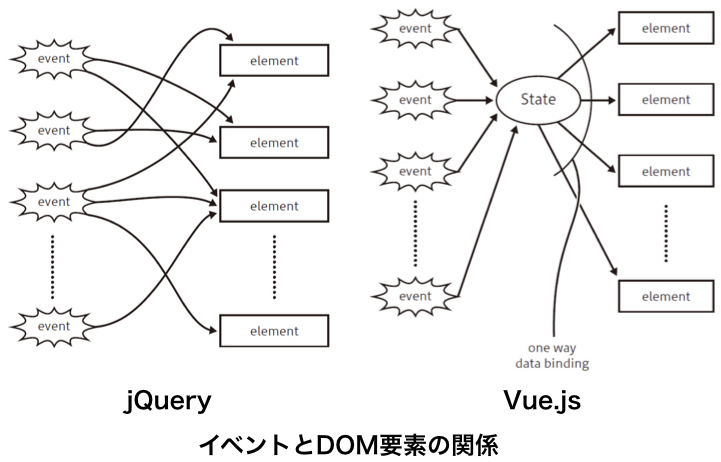

# 2章
# Vue.jsの基本

---

## *はじめに*

### *注意事項*

- *このリポジトリは[[秋葉原] Vue.js入門 輪読会 2章 Vue.jsの基礎 (初心者歓迎！)](https://weeyble-js.connpass.com/event/131771/)の発表資料として用意したリポジトリです。*
- *書籍の要約は正体、担当者の理解で書いているところは斜体で記載しています。*
- *権利関係で問題があれば、対応するのでご指摘ください。*

---

## 2章 Vue.jsの基本

- 「文房具の購入フォーム」の作成を通して、Vue.jsの基本的な機能をマスターする。
- Vue.jsでのUIを構成する３要素
  + データ
  + データを画面に表示するビュー
  + データを変更するユーザのアクション

---

## 2.1 Vue.jsでUIを構築する際の考え方

- jQueryのコーディングスタイルからVue.jsのコーディングスタイルへ頭を切り替える必要がある

--



--

||jQuery|Vue.js|
|---|---|---|
|特徴|イベントリスナーが自身や他のDOM要素を操作|イベントと要素の間に「UIの状態」（state）が挟まる|
|イベントや要素の増加による影響|イベントの要素にどのような影響を与えるか、イベントと要素の組み合わせを意識する必要がある|イベントによるUIの状態の変更、それに伴うDOMツリーやDOM要素の更新に分けて単純に考えることができる|

--

||jQuery|Vue.js|
|---|---|---|
|コーディングスタイル|**DOMツリーを中心に捉える。**DOMツリーがUIの状態を持っており、イベントによってDOMツリーをどのように変更するか考える|**UIの構築を担うJavaScriptのオブジェクト(仮想DOM)を中心に捉える。**データ、ビュー、アクションという3つの視点を切り替えながら、UIの構築を進めていく|

--

### 参考

- [なぜ仮想DOMという概念が俺達の魂を震えさせるのか](https://qiita.com/mizchi/items/4d25bc26def1719d52e6)
  + 仮想DOMとは何か、なぜ仮想DOMか
  + Fluxとは何か、なぜ今Fluxか
  + *フロントエンドのパラダイムシフトの概要を抑えられてわかりやすい。（Vueの話はない）*
- [mozaic.fm ep13 Virtual DOM](https://mozaic.fm/episodes/13/virtual-dom.html)
  + 上の記事踏まえたPodcast

---

## 2.2 Vue.jsの導入

```html
<!DOCTYPE html>
<html lang="ja">

  <head>
      <meta charset="UTF-8">
      <meta name="viewport" content="width=device-width, initial-scale=1.0">
      <meta http-equiv="X-UA-Compatible" content="ie=edge">
      <script src="https://unpkg.com/vue@2.5.17"></script>
  </head>

```

--

```html

  <body>
    <div id="app">
        <p>
            {{ message }}
        </p>
    </div>


```

--

```html

    <script>
        // ロードされ、Vueがグローバル変数として定義されているか確認
        console.assert(typeof Vue !== 'undefined');
        new Vue({
            el: '#app',
            data: {
                message: 'こんにちは!'
            }
        });
    </script>
  </body>
</html>
```

---

- [JSFiddle](https://jsfiddle.net/kitak/ufzsw5jL/4/)
- JSFiddleにそのまま描いても動かない。
- データバインディングを体感。参考: 1.2.3 リアクティブなデータバインディング

--

### Column Vue.jsの高度な環境構築

- 本章はVue.jsの基本機能の利用のみなので、script要素でライブラリを直接読み込む簡易な開発方法を用いた。
- SPAなど複数ファイルで構成されるアプリを開発する場合は、webpackなどのバンドルツールを利用すべき。
- Vue CLIを用いると高度な環境を比較的簡単に構築できる。Vue CLIは6章で紹介する。

---

## 2.3 Vueオブジェクト

- グローバル変数Vue
  + コンストラクタ
  + モジュール

--

### 2.3.1 コンストラクタ
|オプション名|内容|紹介箇所|
|------|------|------|
|data|UIの状態・データ|2.5|
|el|Vueインスタンスを、マウントする要素|2.4|
|filters|データを文字列と整形する|2.7|
|methods|イベントが発生した時などの振る舞い|2.10|
|computed|データから派生して算出される値|2.8|
</span>

```js
var vm = new Vue({
    // ...
})
```

--

### Column MVVMパターン

- M: ビジネスロジックや内部の処理を担うModel
- V: レイアウトや見た目を担うView
- VM: View向けの状態の管理を担うViewModel

--

### 2.3.2 コンポーネント

---

## 2.4 Vueインスタンスのマウント

- マウント: 既存のDOM要素をVue.jsが生成するDOM要素で置き換えること
- 本節では2通りのDOM要素の指定方法を紹介
  + 2.4.1 インスタンス生成時にelプロパティで与える方法
  + 2.4.2 $mountメソッドを呼び出して後から指定する方法

--

### 2.4.1 Vueインスタンスの適用（el）

--

### 2.4.2 メソッドによるマウント（$mountメソッド）

- マウント対象のDOM要素がUI操作や通信などで遅延的に追加される場合に使う

--

### Column Vue.jsを既存アプリケーションに導入する

---

## 2.5 UIのデータ定義（data）

### dataプロパティ

- UIの状態となるデータのオブジェクトを指定
- Vue.jsのリアクティブシステムに乗る
- [dataプロパティのサンプル](https://jsfiddle.net/kitak/ufzsw5jL/4)

--

### 2.5.1 Vueインスタンスの確認

--

### 2.5.2 データの変更を検知する

```js
vm.$watch(function () {
  //鉛筆の個数
  return this.items[0].quantity
}, function (quantity) {
  //このコールバックは、鉛筆の購入個数が変更されたら呼ばれます
  console.log(quantity)
})
```

vm.items[0].quantity=2

---

## 2.6 テンプレート構文

テンプレートでは、Vueインスタンスのデータとビュー(DOMツリー)の関係を宣言的に定義する。HTMLのテキストコンテンツへのデータの展開はMustache記法を用い、HTMLの属性を用いた独自の拡張にはディレクティブを用いる。（*例：v-bind:属性名="データを展開した属性値"*）JavaScriptの式は記法の中に１つしか書けないことに注意。

### 2.6.1 テキストへの展開

--

### 2.6.2 属性値の展開

--

### 2.6.3 JacaScript式の展開

- 計算もできる

---